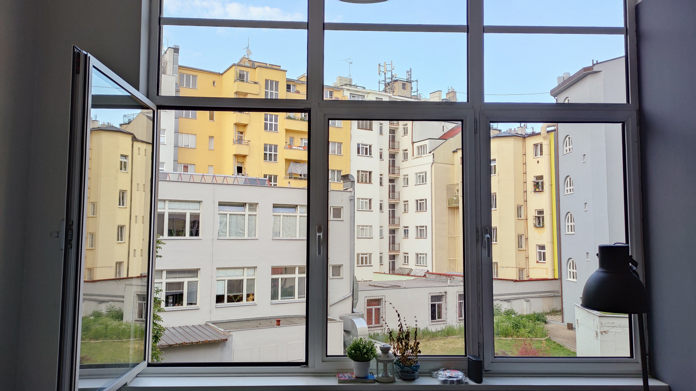

# SAI Stage report at Prague
### introduction
Je pars pour Prague en compagnie de ma collègue, Victoria Rémont.  
Ce stage va durer 4 mois, et j'ai déjà des objectifs clairs: 
- Have better level in english, because i have yet a bad level 
- Mieux comprendre les enjeux de la cyber sécurité
- Avoir une meilleure ouverture d'esprit, au niveau de la culture comme de la vie en entreprise
- Etre autonomes de A a Z.

Au vu des publications, que j'espère régulière, et de mon niveau d'orthographe, s'il y a des fautes, elles seront corrigées aux files du temps, merci de pas en tenir compte !  
Ajout philosophique du 06: je laisserai peut être les fautes d'orthographe et mauvaise formulation sur la version anglaise, afin de noter l'évolution de ma maitrise  

# Juin
>## [Première journée !!!](june/03.md)
>## [It's the story of a second day](june/04.md)  
>## [It's the story of a fourth day (yes, not third)](june/06.md)  
>## [A first day of work](june/07.md)  
>## [A *second* day of work](june/08.md)   
>## [oh no I fell asleep really early so I will write 2 days in one](june/09.md) 
>## [Last day of long week (not sunday, friday please)](june/10.md)
>## [Do not read this !](june/11.md)   

# Juillet
# Août
# September

# Section fond d'écran!
   
  
[return](../README.md)
