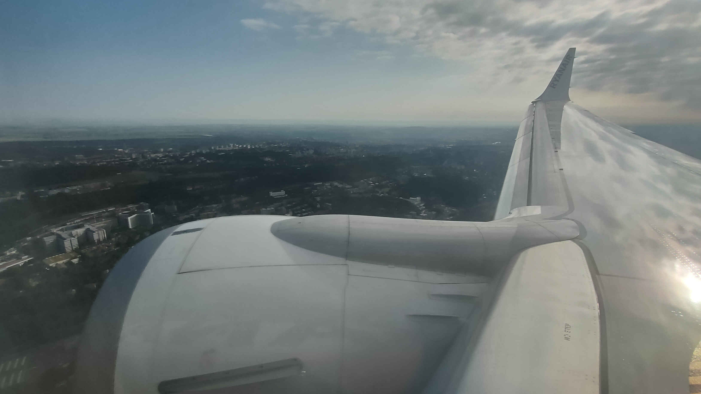
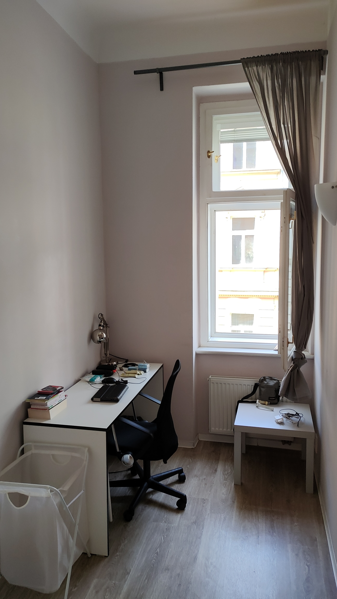

# 03/06/2022 - Départ pour prague
## Avion
Enfin le départ ! J'écris actuellement depuis l'avions, qui ne tardera pas a partir (6h20)  
Il n'y a pas eu de problème lors de l'embarquement, j'attends maintenant avec impatience l'arrivée dans un nouveau pays  
Je ne suis pas aussi content de partir que l'on pourrait croire, j'ai conscience des nombreuses difficultés auquel je vais devoir faire face, notamment la barrière de la langue (Vive l'anglais, 8 au bac ça veut tout dire)  
  
En espérant arriver en vie ☻ j'ecrirai une suite ce soir ^^  
Et évidemment, papa et maman vous allez me manquer mais tout va bien se passer 

## Americka 36 - l'appartement
Ouf toujours en vie! Nous avons débarqué vers 8h a l'aéroport de Prague, pour ensuite prendre le bus, puis le métro, avec nos 80 kilos d'affaires (me suis faits avoir, répartition 66/33)
Après un petit dèj à la pizza, nous nous sommes posé devant l'église et attendu l'heure de la rencontre avec la logeuse  
Nous sommes alors partie visiter Prague (FAUX! objectif retirer de l'argent, faire les cours de première nécessité et effectuer un repérage de notre lieu de travail)  
  
Après quelques douleurs au pied et fatigue musculaire intense (6h de marche !) nous nous sommes enfin posé à l'appartement (gros dodo)  
  
Actuellement, nous n'allons pas tarder à aller manger, bonne soirée !  
  
[return](../README.md)