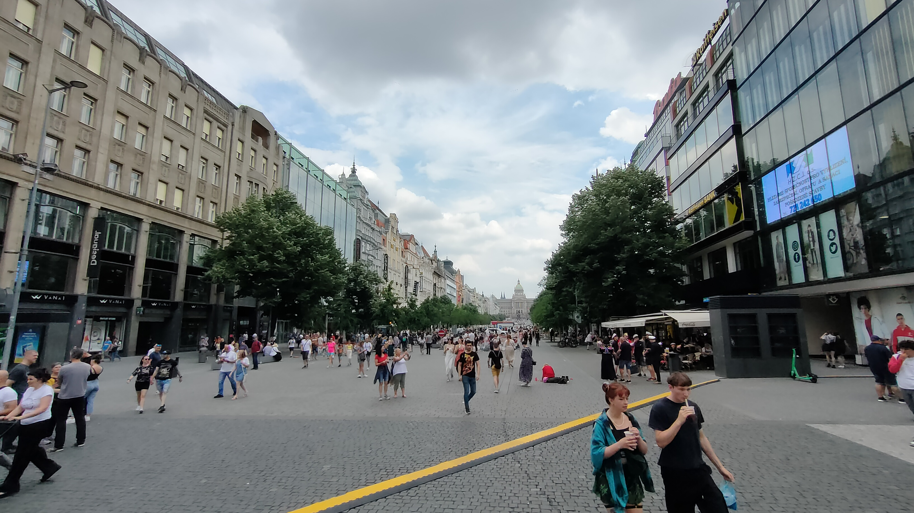

# 04/006/2022 - IKEA and city center !
So i will write this in english because i am in the living room, and i had speak with a flemench elgium student (she don't speak french !!!)  
My day begin with hard stand up, because my bed is soooooo confortable. First task of the day is to go to IKEA to buy some stuff, like miror or a pillow. After thaht, we decided to go in the city center to buy some food (trdelnik) and visit.  
  
The tiedless catch us and we return to the appartment to sleep or just bbe sit. A good small day i think ! 
Oh, one more before end of writing: Wee know actually all pepole of collocation !!! We are 6, 2 girl and 4 boy, 3 french, 1 belgium, 1 german and 1 ireland. So, it's cool !

[return](../README.md)