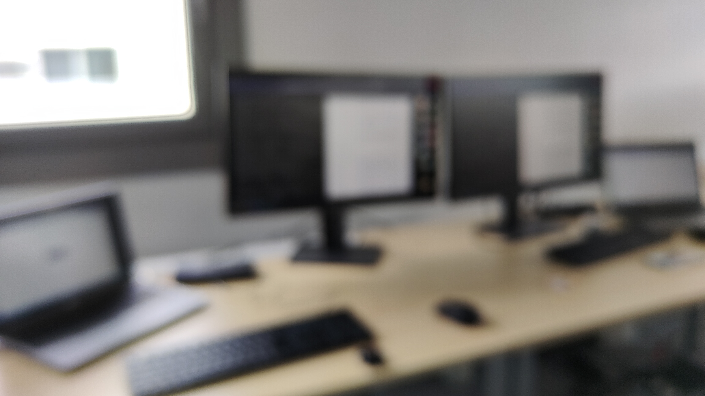

# A good day is today
The objective of this morning was not very hard : registration with the foreign police.. so get up earlier  
We walked to be in front of the police building at 8am  
We tryed to take a number ticket, but no paper and the policeman.. don't speak english  
Thank to an other guy who translate our english to czech, and we managed to make him undertand the purpose of our visit  
Good news, after 30 min to wait the appoitment (yes, the ticket), we learn the registration has already been made (by our landlady)  
After that, we were finally able to go to thales to start the day's work  
Or not very, because we don't have yet the admin right on our computer (so, we only do some documentation and search)  
OH, for meals, we decided to go in a supermarcket and i buy lowcost food : 2 savory pasteries and waffles for less than 100 crowns (It's the budget of one meal, according to out daily restaurant card budget)
At 17pm, we participated as extra to a sprint meeting organized by rémi.V (Yesterday we ask him if we can view what is a real sprint meeting and he said yes)  
So, a sprint meeting is :  
- Some information of all individual progress
- Some demonstration (not only graphique demonstration)
- What will be for the next   

   

*yes, the picture is blurry because of confidentiality*  

End day, and we cook a basic but good dinner: Pasta, scrambled egg, onions and pea (and thank to the creator of the tupperware)
Good night and don't forget : waste is not good, so save everything you can for the next day (not only food, good humor, the desire to play sports, etc)  

ps: Sorry for the quality and quantity, but i am tired today  

[return](../README.md)